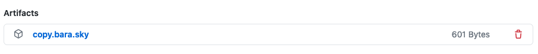

# Advanced usage

## What this action does

This action manages 3 workflows out of the box (init, push, pr) and essentially does two things:

1. **Detect** which workflow to run depending on the context:

   - _Push to SoT and non existing destination branch_ => **init**
   - _Push to SoT and destination branch exists_ => **push**
   - _PR opened/changed on destination_ => **pr**

2. **Generate** a configuration for each workflow

## What you can do

- You can override the first step and force a specific workflow to run.
- You can override the configuration for one or all workflows.
- You can override many other [options](options.md).

## Force specific workflows

## Custom Copybara config

### Generated config

So you don't have to start your config from scratch, let's download your current generated one.

When you enable debug mode, this action will create an artifact containing your copy.bara.sky configuration.

1. In your repos, set the secret `ACTIONS_STEP_DEBUG` to `true`
2. Run the action workflow (most likely create a commit in SoT and a PR in destination)
3. Check out the artifacts for this workflow run

