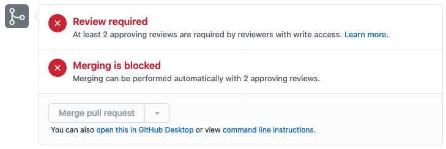
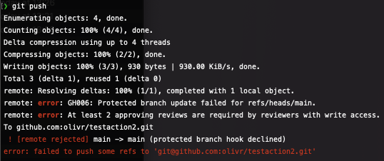

# Branch protection in your destination repo

According to our Copybara flow, we do not want to be able to push changes to the destination branch. Any change must happen through a pull request that is merged on the **SoT branch**.

Thankfully, GitHub has a feature called [branch protection](https://docs.github.com/en/github/administering-a-repository/about-protected-branches).

Unfortunately, these rules also apply to our Copybara user and you can't add an exception for a specific user.

Here is a workaround that should work for most people.

## Workaround

**In your destination repo**

[Protect your main/master branch](https://docs.github.com/en/github/administering-a-repository/configuring-protected-branches) with the following options:

- [x] Require pull request reviews before merging (> 2 approving reviews is good)
- [x] Require review from Code Owners
- [x] Include administrators
- [x] Allow force pushes

Now, you cannot commit **unless you force-push** to the main branch so it doesn't make it impossible to commit but it sends you quite a few signals before you can do so...

> The following screenshots are all taken from a user with admin access to the repository

### Branch protection settings

### Cannot merge

### Cannot commit in the UI

### Cannot commit in the CLI

